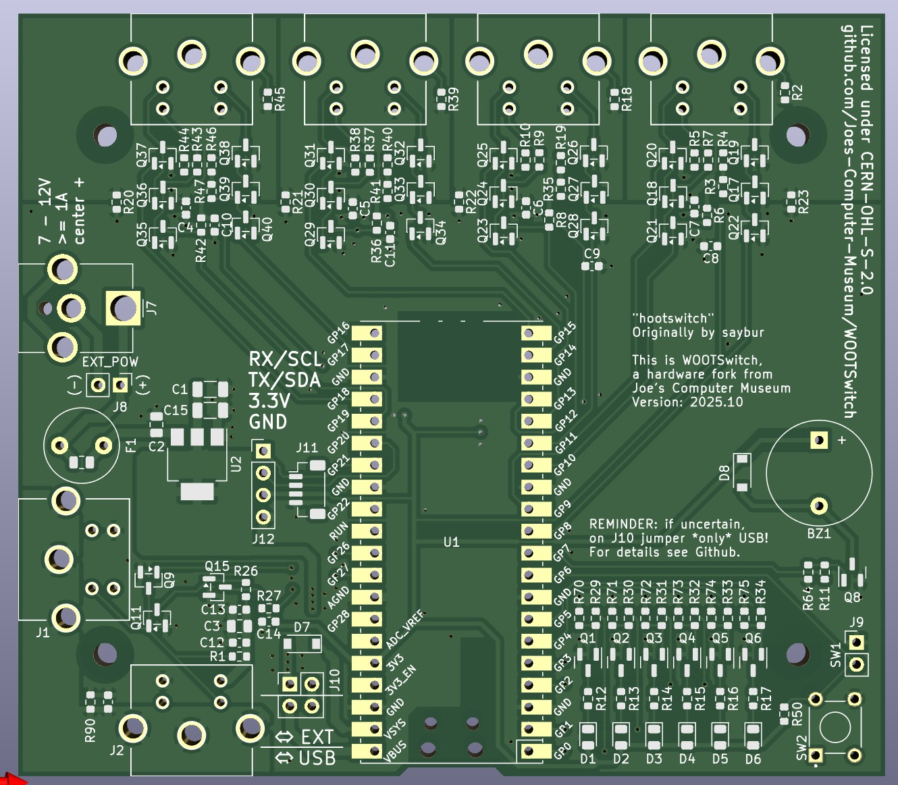

hootswitch
==========

Hootswitch is a prototype [ADB](https://en.wikipedia.org/wiki/Apple_Desktop_Bus)
multiplexer that allows peripherals (inluding keyboards and mice) to be shared
across up to four retro computers.



This project has two parts: an example hardware design and the firmware,
located in their respective folders in this repo.

Status
------

Basic ADB keyboards and mice are supported. Switching between computers works
via the button on the front or <kbd>Control</kbd> / <kbd>Option</kbd> /
<kbd>⌘</kbd> / <kbd>Shift</kbd> in sequence, followed by <kbd>1</kbd> -
<kbd>4</kbd> to choose a port.

The firmware is still under active development and many bugs remain. Known
issues include:

- Mouse input can be a bit "floaty" especially during extreme movements.
- No other ADB devices besides keyboards/mice are supported yet.
- No features based on the Pico W wireless chip have not been implemented.

This section will continue to be updated as progress is (hopefully) made.

Building
--------

You will need the Pico SDK and associated tooling. There is a setup script
[here](https://raw.githubusercontent.com/raspberrypi/pico-setup/master/pico_setup.sh)
that assumes you're using a Raspberry Pi as your development environment if you
want to try that; I personally use Debian _bookworm_ on a regular x86 system
instead, set up as follows.

Dependencies and associated tools:

```
sudo apt install git cmake gcc-arm-none-eabi gcc gdb-multiarch automake \
    autoconf build-essential texinfo libtool libftdi-dev libusb-1.0-0-dev \
    openocd
```

Clone the [Pico SDK](https://github.com/raspberrypi/pico-sdk). Execute
`git submodule update --init` in that project to get sub-libraries added. Set
`PICO_SDK_PATH` to point at where the SDK lives via `~/.bashrc` or equivalent;
something like `export PICO_SDK_PATH=/home/saybur/src/pico-sdk` would be
suitable after being adjusted for your environment.

Also clone or download [FreeRTOS](https://github.com/FreeRTOS). The LTS release
is likely fine. Set `FREERTOS_KERNEL_PATH` to the folder where
`FreeRTOS-Kernel` is located via the above method.

Once you have everything set up, build as follows from the root of the repo.

```
mkdir -p build
cd build
cmake ../firmware
make
```

Among other files, this will produce `hootswitch.uf2`. Make sure your power
selection is correct, then hold down the BOOTSEL button while you plug in
to your computer via USB. Copy the `.uf2` onto the new mass storage device.
Reboot.

Licenses
--------

Except where otherwise noted, all software is available under the GNU GPL v3.
The example hardware is available under the CERN Open Hardware Licence
strongly-reciprocal variant, version 2. Refer to the licenses for specific
terms.
